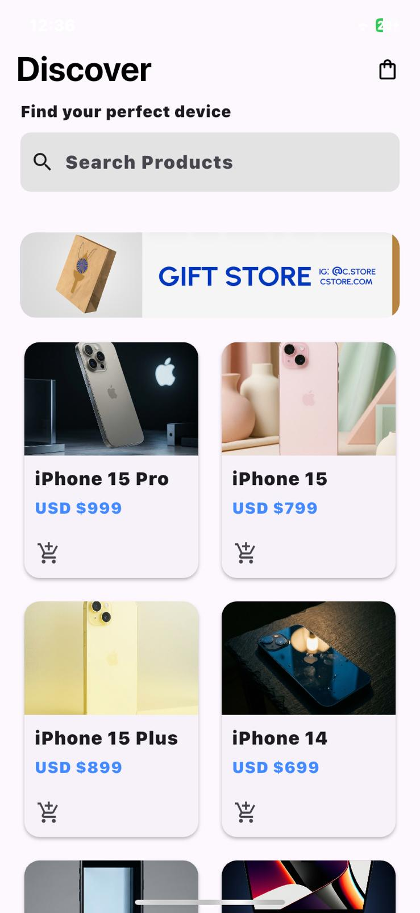
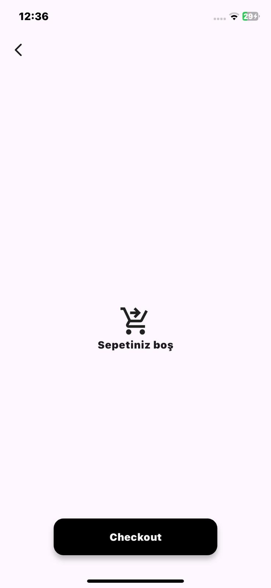
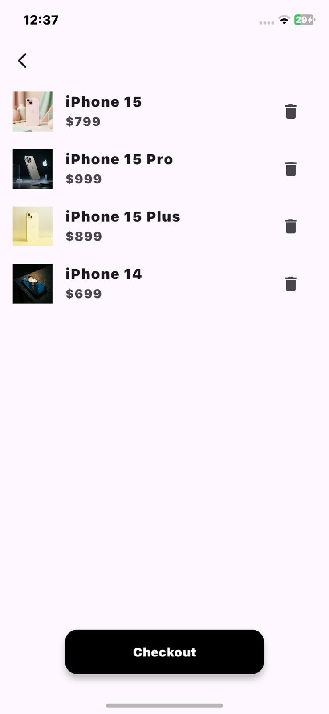

# Mini Katalog App

The application incorporates dynamic listing, page management, and data modeling practices. It provides a structure where users can list products, examine their details, and experience a simple shopping cart simulation.

- **Flutter version used:** Flutter 3.41.4
  
## Operating Steps

To set up the project in your local environment, you can follow these steps in order:
- flutter doctor
- git clone https://github.com/asmss/mini_catalog_app
- cd mini_katalog_app flutter pub get
- flutter run (First, open the emulator)

## Application Screenshots

 
 

